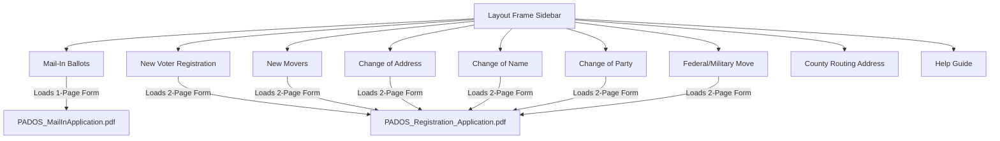

# Pennsylvania Ballot Application Suite — Strategy & Specs

This document outlines the strategic roadmap, priority matrix, and technical design for the Pennsylvania Ballot Application Suite (`mib-pdf-maker`).

---

## 1. Executive Summary & Core Architecture

The goal is to develop a highly secure, lightweight React web application built with **Vite** and hosted on **Firebase Hosting**. The utility allows county election organizers to upload spreadsheet registers of voter applications or manually pre-fill single applications, and instantly download standardized, perfectly aligned PDFs.

The primary user action revolves around bulk CSV uploading and batch printing. To streamline this workflow, the sidebar acts as a **voter action workspace portal**—promoting the primary Application Purposes directly to the main menu bar.

### 🛡️ PII Security-First Architecture (Zero-Server Storage)
Because these files contain highly sensitive Personally Identifiable Information (PII) including full names, birth dates, phone numbers, and addresses:
* **No Server-Side Storing or Processing**: All CSV parsing and PDF generation are performed **entirely in the user's browser** (client-side) using `papaparse` and `pdf-lib`.
* **Zero Data Transmission**: No voter data is uploaded to Firebase or any external database. Once the browser window is closed, all session data is permanently purged from memory.
* **Denial of Service Guardrails**: Files are limited to **5MB** and **500 rows** to protect browser memory performance and prevent local Denial of Service (DoS).

---

## 2. Priority Matrix & Implementation Status

To deliver the suite rapidly while maintaining a robust and extensible codebase, we have structured work into priorities:

### 🔴 High Priority (Completed)
1. **Dynamic Workspace Portal Sidebar Navigation**: Restructured the main menu bar to host the Application Purposes (intents) natively as independent workspaces.
2. **New Movers Batch Workspace**: Created a dedicated, bulk CSV batch printer (`NewMoversBatch.tsx`) tailored specifically for out-of-state new movers, pre-filling the official 2-page voter registration form with automated Section 11/12 annual ballot requests.
3. **Walk List Sorting & Dual-Output Printing**: Programmed an alphanumeric walk-sorting engine (Precinct ➔ Street ➔ House Number ➔ Apt). Generates sorted pre-filled applications and outputs a completely separate, compact, copy-paper-optimized walking checklist PDF.
4. **Dynamic PDF Template Routing**: Dynamically fetches the 1-page **`PADOS_MailInApplication.pdf`** (for Mail-In) or the 2-page **`PADOS_Registration_Application.pdf`** (for the other registration reasons) on the fly.
5. **Multi-Page Compilation Engine**: Extended `pdf-lib` merges to read document page sizes dynamically, compiling multi-page registration applications into a consolidated download.
6. **Flexible Schema Validation**: Enforces only the 19 actually required CSV column headers (pruned `PollingPlaceDescript` and `Municipality`). Optional columns are skipped safely and default to fallbacks.
7. **Wet signature & Alignment Help Guide**: An interactive, lightweight Markdown previewer displaying standard double-sided layouts, scaling parameters, and assembly tutorials.

### 🟡 Medium Priority (Completed)
1. **State-Wide 67 County Mailing Address Registry**: Updated the self-mailer tool to support all 67 Pennsylvania counties with an alphabetical dynamic selector.
2. **Master Chester County Precinct Database**: Compiled and extracted all 230 Chester County precincts into a structured, validated JSON file (`src/utils/precincts.json`).
3. **Coordinate Page Indices Mapping**: Support coordinate properties like `pageIndex` so previous registration details (Section 8) print exactly on Page 2 of the Registration PDF.
4. **Context-Driven Manual Forms**: Built an integrated "Single Manual Entry" tab inside each workspace. Shows/hides Section 8 Previous Registration inputs based on selected intent to reduce operator screen noise.
5. **Sensitive Data Privacy Toggles**: Enforces a privacy toggle checkbox, allowing operators to easily exclude voter Date of Birth or Phone Number from pre-filled forms.
6. **Party Initials Abbreviation Parser**: Standardized a custom R/D/I/G/L/NF mapping engine for walk list copying.
7. **Independent LocalStorage Routing**: Coordinations modified via the Advanced Tuner are saved independently for the 1-page form vs the 2-page form.

### 🟢 Low Priority (Roadmap)
1. **Firebase Authentication (User Login)**: Secure the portal so only registered administrators or organizations can access the tool.
2. **History Log / Batch Metadata**: Record the date, time, and batch count of generated PDFs for administrative reporting (without saving the actual voter PII).

---

## 3. Current Project Architecture

The layout maps each application purpose directly to its respective file template and coordinate routing rules:

---

## 📁 4. Required CSV Schema & Database Mapping

The Pennsylvania Ballot Application Suite uses an advanced **Dynamic Context-Aware Schema Engine** (`src/utils/csvSchema.ts`) that matches the exact column definitions and color codes of your spreadsheet model.

### Database Requirement Tiers

1. **🟢 Universal Core (Green Columns - Mandatory on ALL Uploads):**
   * Verifies voter's primary identity and residential residence:
   * Headers: `First_Name`, `Middle_Name`, `Last_Name`, `Suffix`, `House`, `Street`, `City`, `Zip_Code`, `County`, `Birth_Date`
2. **🔵 Optional Helpers (Blue Columns - Never Trigger Error Blocks):**
   * Helpful metadata parsed cleanly with safe fallback lookups if empty:
   * Headers: `Precinct`, `Phone`, `Email`, `Municipality`, `Ward`, `Lived_Since`, `MAddress`, `MCity`, `MState`, `MZip`
3. **🟡 Reason-Specific Context (Yellow Columns - Checked Contextually):**
   * Strictly checked and required depending on what tab you are on:
     * **Mail-In (`mail-in-voting`)**: `Mib_Address`, `Mib_City`, `Mib_State`, `Mib_Zip` (ballot papers delivery destination)
     * **New Registration (`new-registration`) / Change Party (`party-change`) / Federal (`federal-military`)**: `Reason`, `Citizen`, `Age`, `Gender`, `Party`
     * **Change of Name (`name-change`)**: `Reason`, `Citizen`, `Age`, `Gender`, `Party`, `Prev_Name`
     * **Change of Address (`address-change`) / New Movers (`new-movers`)**: `Reason`, `Citizen`, `Age`, `Gender`, `Party`, `Prev_Address`

### Automated Template Assembler (In-Memory Downloads)
The suite dynamically generates templates on-the-fly. Clicking **"Download Sample CSV"** runs an in-memory compiler that stitches together the exact universal and specific headers required for the selected action, appends useful optional columns, creates a sample mock row, and triggers a download. This maintains your exact spreadsheet column layout order and eliminates the maintenance of separate static file resources.

### Coordinate baselines mapped from your actual dataset:

| CSV Column Name | Internal Key | Page Index | Coordinate (X, Y) | Target Field Section |
| :--- | :--- | :---: | :--- | :--- |
| `Last_Name` | `last_name` | 0 | (248, 698) | Section 1: Last Name |
| `First_Name` | `first_name` | 0 | (248, 676) | Section 1: First Name |
| `Middle_Name` | `middle_name` | 0 | (504, 676) | Section 1: Middle Name |
| `Suffix` (JR, SR, III, IV) | `suffix` | 0 | Checked Coordinates | Section 1: Suffix Checkbox Bubbles (Hollow Rings) |
| `Date_Of_Birth` | `birthdate` | 0 | (272, 568) | Section 2: Date of Birth |
| `RNCfiles.PrimaryPhone` | `phone` | 0 | (230, 550) | Section 2: Phone number |
| `House__` + `StreetNameComplete` | `address` | 0 | (280, 504) | Section 3: Street Address |
| `Apt__` | `suite_number` | 0 | (544, 504) | Section 3: Apt/Suite |
| `City` | `city` | 0 | (242, 486) | Section 3: Registered City |
| `Zip_Code` | `zip_code` | 0 | (432, 486) | Section 3: ZIP Code |
| `County` | `county` | 0 | (524, 486) | Section 3: Registered County (resolved from numerical code) |
| *Derived from Precinct* | `municipality` | 0 | (244, 466) | Section 3: Registered Municipality (resolved from precincts.json) |
| `Ward` | `ward` | 0 | (390, 436) | Section 3: Ward |
| `MAddress_Line_1` + `MAddress_Line_2` | `mailing_address` | 0 | (356, 422) | Section 4: Alternative Mailing Address |
| `MCity` | `mailing_city` | 0 | (234, 402) | Section 4: Mailing City |
| `MState` | `mailing_state` | 0 | (480, 402) | Section 4: Mailing State |
| `MZip_Code` | `mailing_zip` | 0 | (528, 402) | Section 4: Mailing ZIP |
| `VBM.AppType` / `annual_request` | Forces Section 7/11 True | 7 / 11 | (189, 643) [Page 2 Section 11] / (190, 208) [Page 1 Section 7] | Section 7/11: Annual Ballot Request Checkbox |
| `Prev_Name` | `prev_name` | 1 | (248, 312) | Section 8: Previous Registered Name (Page 2) |
| `Prev_Address` | `prev_address` | 1 | (248, 268) | Section 8: Previous Street Address (Page 2) |
| `Prev_City` | `prev_city` | 1 | (242, 224) | Section 8: Previous City (Page 2) |
| `Prev_State` | `prev_state` | 1 | (390, 224) | Section 8: Previous State (Page 2) |
| `Prev_Zip` | `prev_zip` | 1 | (432, 224) | Section 8: Previous ZIP (Page 2) |
| `Prev_County` | `prev_county` | 1 | (524, 224) | Section 8: Previous County (Page 2) |

*Note: Suffixes JR, SR, II, III, and IV print as hollow vector circle outlines (radius: 7 points, stroke thickness: 1.5 points) centered perfectly on target bubbles.*

---

## 🤖 5. Automated Prompt Engineering Integration
Always append the following trigger phrase to your prompt to automatically force the AI model to read and load these system files:
> **`"Look at PROMPTS.md and STRATEGY.md to see our mappings."`**
