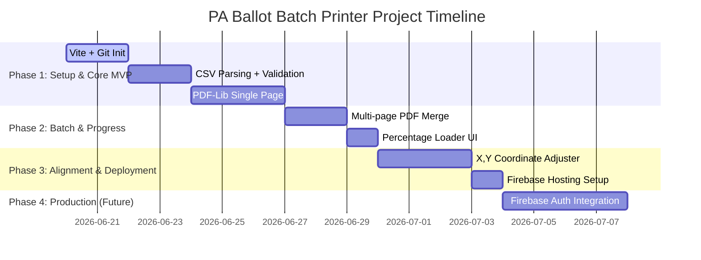

# Pennsylvania Mail-in Ballot Application Batch Printer — Strategy & MVP Specifications

This document outlines the strategic roadmap, priority matrix, and technical design for the Pennsylvania Application for Mail-In Ballot batch printing utility. 

---

## 1. Executive Summary & Core Architecture

The goal is to develop a highly secure, lightweight React web application built with **Vite** and hosted on **Firebase Hosting**. The utility allows county election officials or voter outreach groups to upload a spreadsheet of voter registrations (up to 25 records per batch) and output a single, consolidated, printable PDF containing pre-filled Pennsylvania Mail-in Ballot applications.

### 🛡️ PII Security-First Architecture (Zero-Server Storage)
Because the CSV files contain highly sensitive Personally Identifiable Information (PII) including full names, birth dates, phone numbers, and addresses:
* **No Server-Side Storing or Processing**: All CSV parsing and PDF generation are performed **entirely in the user's browser** (client-side) using `papaparse` and `pdf-lib`.
* **Zero Data Transmission**: No voter data is uploaded to Firebase or any external database. Once the browser window is closed, all session data is permanently purged from memory.
* **Compliance**: This client-side-only architecture guarantees complete compliance with data privacy standards and eliminates server-side liability for PII storage breaches.

---

## 2. Priority Matrix

To deliver a Minimally Viable Product (MVP) rapidly while keeping the codebase robust and extensible, we have categorized tasks into **High**, **Medium**, and **Low** priorities.

### 🔴 High Priority (Core MVP Functional Requirement)
1. **Client-side PDF Text Rendering**: Implement `pdf-lib` to overlay custom text fields on the official `PADOS_MailInApplication.pdf` template with X, Y precision.
2. **Consolidated Batch Generation**: Merge multiple filled application pages into a single, multi-page, printable PDF document.
3. **CSV Validation and Processing**:
   * Verify file extension is `.csv`.
   * Ensure the CSV has all required headers (even if cell values are empty/null).
   * Enforce a hard cap of **25 records per batch** to protect memory limits and prevent browser crashes.
4. **Interactive File Upload Dashboard**: A clean and simple drag-and-drop landing page.
5. **Auto-Download Trigger**: Automatic download of the completed PDF batch once generated.
6. **Git Version Control**: Initialize git repo and maintain clean commits.

### 🟡 Medium Priority (Enhanced User Experience & Refinements)
1. **Progress Percentage Dialog**: Visual representation of the merge operation (e.g., "Processing Record 12 of 20 - 60% complete") with a smooth transition.
2. **Visual Coordinate Adjuster**: A collapsible control panel in the browser letting users adjust X, Y coordinates and font sizes per field in real-time, helping to troubleshoot printer margin misalignments.
3. **Alignment Test Printer**: A "Test PDF" button to download a single-page sample containing sample text or the first record to verify alignment quickly before running a 25-record batch.
4. **CSV Schema Inspector & UI Validation Warnings**: Explicitly list which headers are missing, misnamed, or extra in the UI rather than failing silently.

### 🟢 Low Priority (Future Roadmap & Scaling)
1. **Firebase Authentication (User Login)**: Secure the portal so only registered administrators or organizations can access the tool.
2. **History Log / Batch Metadata**: Record the date, time, and batch count of generated PDFs for administrative reporting (without saving the actual voter PII).
3. **Multiple State Templates**: Expand from Pennsylvania to other state ballot application formats.
4. **Permanent Configuration Profiles**: Save custom X, Y coordinate adjustments to local browser storage (`localStorage`) so alignment settings persist across sessions.

---

## 3. Timeline to Completion

This is designed as an agile, 4-phase rollout, taking the project from a local prototype to a production-grade secured app.

### Phase 1: Core Engine & Client Validation (Days 1–5)
* Scaffold React-Vite project with Tailwind.
* Implement client-side CSV loading via `papaparse` with rigid schema-checking.
* Establish standard PDF-Lib overlay coordinates for a single-voter record.

### Phase 2: Consolidated Batch Printing & Flow Control (Days 6–8)
* Programmatic merge function utilizing PDF-Lib `copyPages` to write individual records and merge them into a single file.
* Develop the circular or linear Percent Completion progress modal dialog.

### Phase 3: Visual Alignment & Deployment (Days 9–11)
* Create the X/Y coordinate tuner in the UI so the user can nudge coordinates.
* Deploy the prototype to **Firebase Hosting** and configure browser assets.

### Phase 4: Production Hardening (Future Timeline - 4 Days)
* Integrate Firebase Auth to protect the route.
* Add logging audits (e.g. log the event of "User X printed 22 ballots") while preserving PII confidentiality.

---

## 4. Required CSV Schema & Database Mapping

To ensure successful parsing, the CSV must include the following headers (even if values are empty):

| Header Column Name | Description | PDF Target Section | Default PDF Coordinate (X, Y) in Points |
| :--- | :--- | :--- | :--- |
| `last_name` | Voter's last name | 1 (Last name) | (255, 642) |
| `suffix` | Jr, Sr, II, III, etc. | 1 (Suffix box) | (425, 642) |
| `first_name` | Voter's first name | 1 (First name) | (255, 625) |
| `middle_name` | Middle name/initial | 1 (Middle name) | (425, 625) |
| `birthdate` | Date of birth (MM/DD/YYYY)| 2 (Birth date) | (255, 592) |
| `phone` | Phone number (optional)| 2 (Phone) | (370, 592) |
| `email` | Email address (optional)| 2 (Email) | (255, 575) |
| `address` | Street Address (no P.O. Box)| 3 (Address) | (255, 540) |
| `suite_number` | Apt/Suite number | 3 (Apt. number) | (430, 540) |
| `city` | Registered City/Town | 3 (City/Town) | (255, 523) |
| `state` | Registered State (default PA)| 3 (State) | (355, 523) |
| `zip_code` | 5-digit ZIP code | 3 (ZIP Code) | (390, 523) |
| `municipality` | Local Municipality | 3 (Municipality) | (255, 502) |
| `county` | County of Registration | 3 (County) | (370, 502) |
| `precinct` | Voting precinct / district | 3 (Voting district) | (255, 478) |
| `ward` | Voting ward | 3 (Ward) | (370, 478) |
| `mailing_address` | Alt Mail Address (if different)| 4 (Address/P.O. Box)| (320, 412) |
| `mailing_city` | Alt Mail City | 4 (City/Town) | (255, 395) |
| `mailing_state` | Alt Mail State | 4 (State) | (370, 395) |
| `mailing_zip` | Alt Mail ZIP | 4 (Zip) | (405, 395) |
| `annual_request` | Set to `true` or `yes` to request | 7 (Annual mail-in) | (262, 217) [draws an 'X'] |

*Note: Origin (0,0) is at the bottom-left of the standard 612x792 pt page.*
