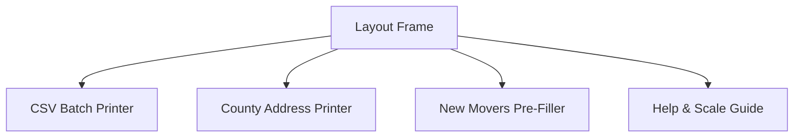

# Pennsylvania Ballot Application Suite — Strategy & Specs

This document outlines the strategic roadmap, priority matrix, and technical design for the Pennsylvania Ballot Application Suite (`mib-pdf-maker`).

---

## 1. Executive Summary & Core Architecture

The goal is to develop a highly secure, lightweight React web application built with **Vite** and hosted on **Firebase Hosting**. The utility allows county election organizers to upload spreadsheet registers of voter applications or manually pre-fill single applications, and instantly download standardized, perfectly aligned PDFs.

### 🛡️ PII Security-First Architecture (Zero-Server Storage)
Because these files contain highly sensitive Personally Identifiable Information (PII) including full names, birth dates, phone numbers, and addresses:
* **No Server-Side Storing or Processing**: All CSV parsing and PDF generation are performed **entirely in the user's browser** (client-side) using `papaparse` and `pdf-lib`.
* **Zero Data Transmission**: No voter data is uploaded to Firebase or any external database. Once the browser window is closed, all session data is permanently purged from memory.
* **Compliance**: This client-side-only architecture guarantees complete compliance with data privacy standards and eliminates server-side liability for PII storage breaches.

---

## 2. Priority Matrix & Implementation Status

To deliver the suite rapidly while maintaining a robust and extensible codebase, we have structured work into priorities:

### 🔴 High Priority (Completed)
1. **Client-side PDF Text Rendering**: Implement `pdf-lib` to overlay custom text fields on official templates with X, Y precision.
2. **Consolidated Batch Generation**: Merge multiple filled application pages into a single, multi-page, printable PDF document.
3. **CSV Validation and Processing**: Rigid checking of column headers and a 500-record batch safety limit.
4. **County Mailing Address Page**: Pre-fill the official envelope cover sheet (`PADOS_address_page.pdf`) based on selected county (Berks, Chester, Delaware, Montgomery) with standard window envelope positioning.
5. **Interactive Sidebar Navigation Layout**: Beautiful dashboard with modular component tabs.

### 🟡 Medium Priority (Completed)
1. **Modern Typography Integration**: Loads clean **Inter Medium (weight 500)** font from jsDelivr CDN for highly crisp, legible printed text.
2. **Individual manual pre-filler**: Manual entry form for new residents that fills the official **`PADOS_Registration_Application.pdf`** template.
3. **Advanced Envelope Tuners**: Built-in coordinate editors to "nudge" positions in real-time.
4. **Mobile Browser Compliance**: Refactored inputs into native `<label>`-associated elements so files can be uploaded flawlessly from Android/iOS.

### 🟢 Low Priority (Roadmap)
1. **Firebase Authentication (User Login)**: Secure the portal so only registered administrators or organizations can access the tool.
2. **History Log / Batch Metadata**: Record the date, time, and batch count of generated PDFs for administrative reporting (without saving the actual voter PII).
3. **Local Storage Persistence**: Save fine-tuned coordinate offsets automatically across sessions.

---

## 3. Current Project Architecture



---

## 4. Required CSV Schema & Database Mapping

To ensure successful parsing, the CSV must include the following 24 exact export headers:

```csv
Precinct,First_Name,Middle_Name,Last_Name,Suffix,Date_Of_Birth,House__,StreetNameComplete,Apt__,City,State,Zip_Code,MAddress_Line_1,MAddress_Line_2,MCity,MState,MZip_Code,PollingPlaceDescript,Ward,RNCfiles.PrimaryPhone,Voter_Status,RNCfiles.OfficialParty,RNCfiles.Age,VBM.AppType
```

Coordinates are configured around standard Letter dimensions (`612 x 792 points`):

| Header Column Name | Description | PDF Target Section | Default PDF Coordinate (X, Y) in Points |
| :--- | :--- | :--- | :--- |
| `Last_Name` | Voter's last name | 1 (Last name) | (242, 702) |
| `First_Name` | Voter's first name | 1 (First name) | (242, 680) |
| `Middle_Name` | Middle name/initial | 1 (Middle name) | (502, 680) |
| `Suffix` (JR, SR, II, III, IV) | Suffix (hollow vector circle) | 1 (Suffix bubbles) | JR: (412, 702), SR: (435, 702), II: (458, 702), III: (481, 702), IV: (504, 702) |
| `Date_Of_Birth` | Date of birth | 2 (Birth date) | (272, 646) |
| `RNCfiles.PrimaryPhone` | Phone number | 2 (Phone) | (398, 646) |
| `House__` + `StreetNameComplete` | Combined Street Address | 3 (Address) | (272, 592) |
| `Apt__` | Apt/Suite number | 3 (Apt. number) | (540, 592) |
| `City` | Registered City/Town | 3 (City/Town) | (242, 568) |
| `State` | Registered State (default PA) | 3 (State) | (390, 568) |
| `Zip_Code` | 5-digit ZIP code | 3 (ZIP Code) | (458, 568) |
| `Precinct` | Voting precinct / district | 3 (Voting district) | (262, 518) |
| `Ward` | Voting ward | 3 (Ward) | (480, 522) |
| `MAddress_Line_1` + `MAddress_Line_2` | Combined Alt Mail Address | 4 (Address/P.O. Box)| (360, 468) |
| `MCity` | Alt Mail City | 4 (City/Town) | (254, 444) |
| `MState` | Alt Mail State | 4 (State) | (478, 444) |
| `MZip_Code` | Alt Mail ZIP | 4 (Zip) | (530, 444) |
| `VBM.AppType` | Forces Section 7 True | 7 (Annual mail-in) | (190, 208) [draws an 'X'] |

*Note: Origin (0,0) is at the bottom-left of the standard Letter size page. Font size defaults to `12` with Inter Medium weight.*
